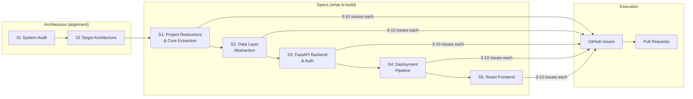

# Architecture Review — Production Readiness

This directory contains architecture documentation and implementation specs for migrating the Earnings Transcript Teacher from a local Streamlit prototype to a deployed SaaS product.

## How this is organized

### Architecture docs vs specs

| | Architecture Docs | Specs |
|---|---|---|
| **Purpose** | Align on direction and decisions | Define what to build |
| **Audience** | Stakeholders, future contributors | The developer implementing it |
| **Detail level** | "We'll use FastAPI on Cloud Run" | "These 5 endpoints with these request/response schemas" |
| **Lifetime** | Long-lived reference | Consumed when issues are created, then archived |
| **Output** | Decisions, rationale | GitHub issues |

## Document Index

### Architecture (reference)

| # | Document | Status | Purpose |
|---|----------|--------|---------|
| 01 | [Current System Audit](01-current-system-audit.md) | Draft | Inventory of what exists: modules, data model, dependencies, coupling |
| 02 | [Target Architecture](02-target-architecture.md) | Draft | Target stack, project structure, environments, API surface overview |

### Specs (implementation-ready)

Specs are ordered by dependency — each builds on the one before it. A spec is **ready** when it has enough detail to generate GitHub issues without architectural guesswork.

| # | Spec | Status | Depends On | Purpose |
|---|------|--------|------------|---------|
| 001 | [Project Restructure & Core Extraction](specs/[001]%20project-restructure.spec.md) | Draft | — | Move business logic into `core/`, update imports, keep Streamlit working |
| 002 | [Data Layer Abstraction](specs/[002]%20data-layer.spec.md) | Draft | 001 | Extract repository interfaces, add user_id scoping, connection pooling |
| 003 | [FastAPI Backend & Auth](specs/[003]%20backend-api.spec.md) | Draft | 001, 002 | FastAPI app, Firebase Auth middleware, API routes, SSE streaming |
| 004 | [Deployment Pipeline](specs/[004]%20deployment.spec.md) | Draft | 003 | Dockerfile, firebase.json, Cloud Run config, CI/CD, environments |
| 005 | [React Frontend](specs/[005]%20frontend.spec.md) | Planned | 003, 004 | React SPA, component hierarchy, routing, data fetching, auth UI |

### Conventions

| Document | Purpose |
|----------|---------|
| [Conventions](conventions.md) | Epic/sub-issue naming, labels, branch naming, PR format, dependency tracking |

## Principles

1. **Spec before code** — Each migration phase starts with a reviewed spec
2. **Preserve the pipeline** — NLP/ingestion is core IP; it migrates with minimal changes
3. **Abstract at boundaries** — Data access and external APIs get abstraction layers
4. **Incremental migration** — Streamlit keeps working throughout; no big-bang rewrite
5. **Firebase-favored, not Firebase-locked** — Leverage Firebase but keep interfaces swappable
