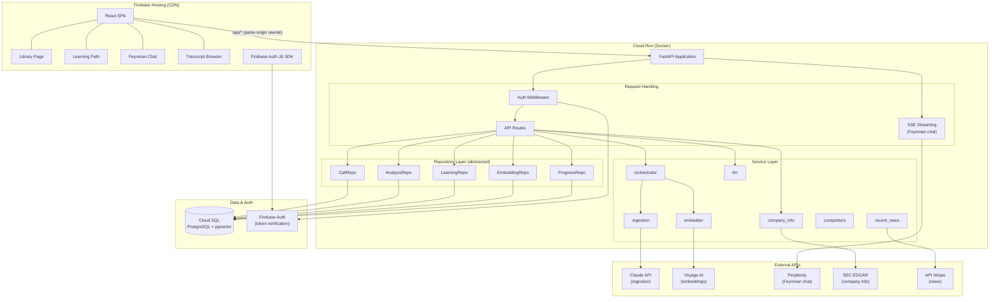
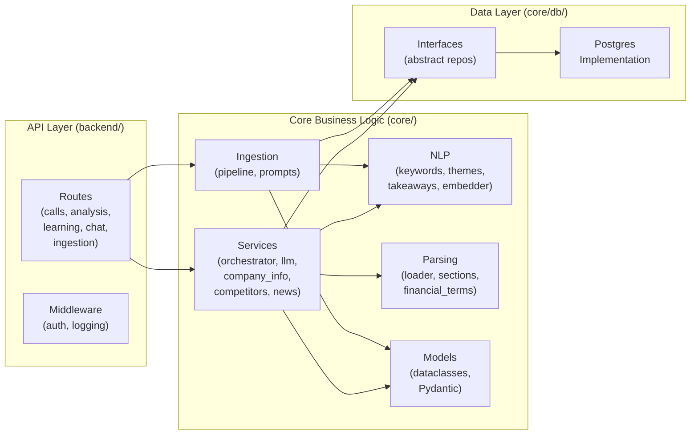
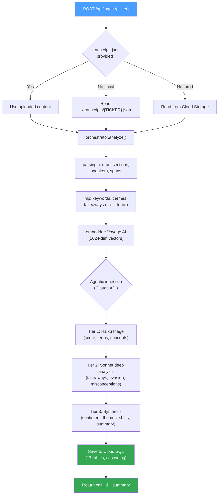
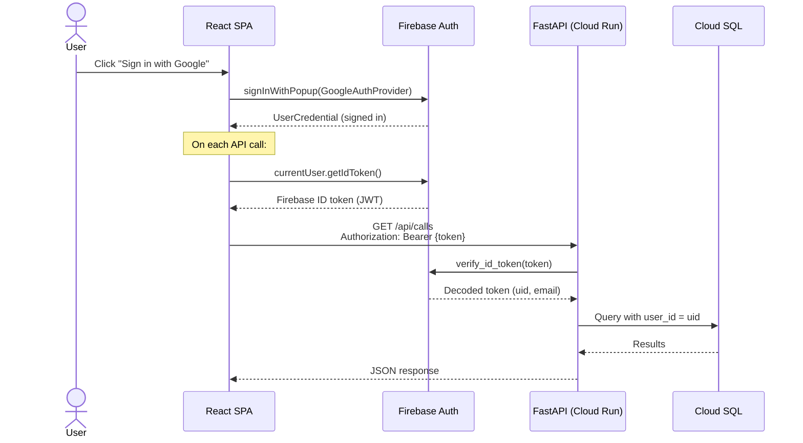
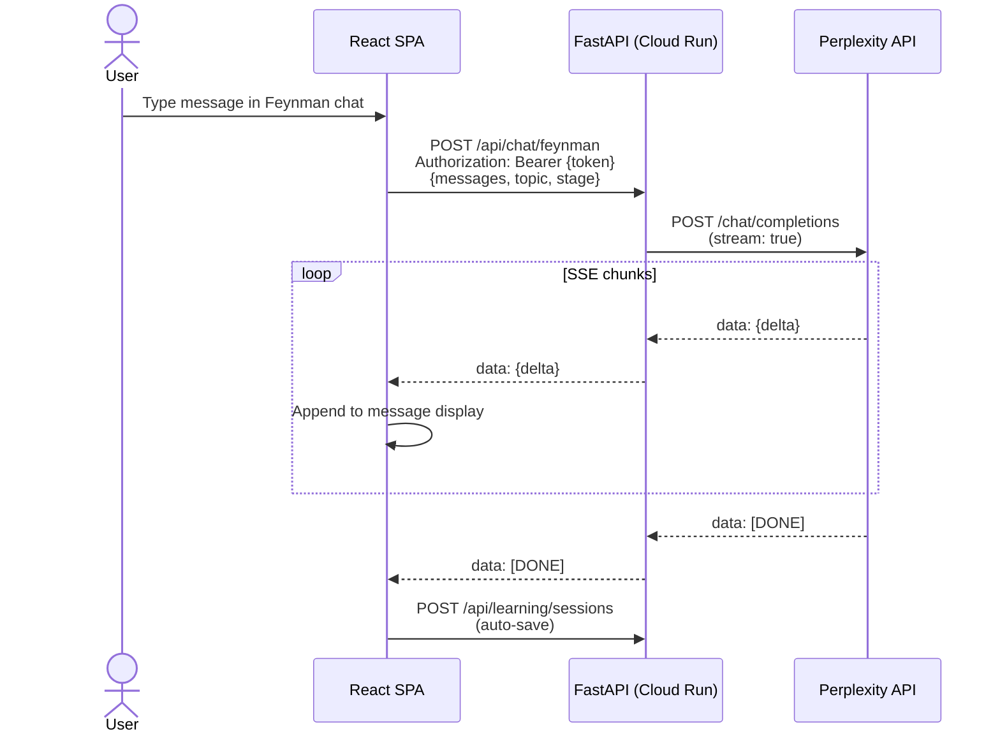
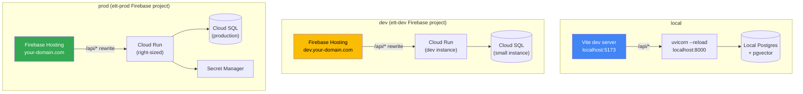
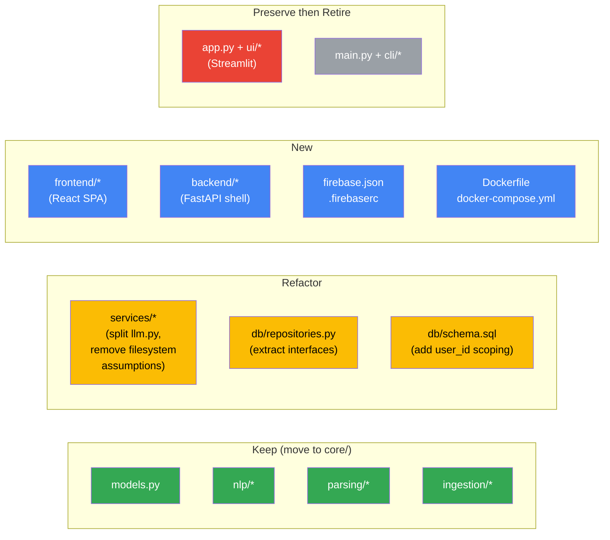

# 02 — Target Architecture

*Status: Draft — ready for review*

---

## 1. Decisions Log

Decisions made during architecture review discussions. These are inputs to this spec, not proposals.

| # | Decision | Rationale |
|---|----------|-----------|
| D1 | React SPA frontend (no SSR) | Suspense + async patterns are sufficient; SSR adds deployment complexity for no current benefit |
| D2 | FastAPI backend on Cloud Run | Python keeps the existing pipeline intact; Cloud Run handles long-running tasks (60s ingestion) and SSE streaming natively |
| D3 | Firebase Hosting for the SPA | Single GCP ecosystem; `/api/*` rewrite routes to Cloud Run under the same domain |
| D4 | Firebase Auth (Google social login first) | Simplest starting point; expand providers later |
| D5 | Cloud SQL for PostgreSQL with pgvector | Minimal migration from current schema; Firebase Data Connect bridges auth. Firestore vector search is still Preview-only |
| D6 | Ingestion stays as a backend process | API endpoint not exposed in the UI; callable for development and future automation |
| D7 | No Vercel for now | Firebase Hosting + Cloud Run avoids split-platform complexity and cost |

---

## 2. System Architecture

### High-level system diagram



### Backend layered architecture



---

## 3. Project Structure

The current flat structure needs to evolve to separate the frontend, backend, and shared concerns. A **monorepo** keeps everything in one place during the transition — the Streamlit app continues to work alongside the new stack.

### Proposed directory layout

```
earnings-transcript-teacher/
│
├── frontend/                    # React SPA (new)
│   ├── src/
│   │   ├── components/          # React components
│   │   ├── pages/               # Route-level components
│   │   ├── hooks/               # Custom React hooks (data fetching, auth)
│   │   ├── services/            # API client functions
│   │   ├── types/               # TypeScript type definitions
│   │   └── App.tsx
│   ├── public/
│   ├── package.json
│   ├── tsconfig.json
│   └── vite.config.ts
│
├── backend/                     # FastAPI application (new)
│   ├── api/                     # Route handlers
│   │   ├── routes/
│   │   │   ├── calls.py         # /api/calls/* endpoints
│   │   │   ├── analysis.py      # /api/analysis/* endpoints
│   │   │   ├── learning.py      # /api/learning/* endpoints
│   │   │   ├── chat.py          # /api/chat/* (SSE streaming)
│   │   │   └── ingestion.py     # /api/ingest/* (not UI-exposed)
│   │   └── deps.py              # Shared dependencies (auth, db session)
│   ├── middleware/
│   │   └── auth.py              # Firebase token verification
│   ├── config.py                # Environment-aware configuration
│   ├── main.py                  # FastAPI app factory
│   ├── Dockerfile
│   └── requirements.txt         # Backend-only dependencies
│
├── core/                        # Shared domain logic (exists, evolves)
│   ├── models.py                # Domain dataclasses (unchanged)
│   ├── services/                # Business logic (moved from services/)
│   │   ├── orchestrator.py
│   │   ├── llm.py
│   │   ├── company_info.py
│   │   ├── competitors.py
│   │   └── recent_news.py
│   ├── ingestion/               # LLM pipeline (moved from ingestion/)
│   │   ├── pipeline.py
│   │   └── prompts.py
│   ├── nlp/                     # NLP functions (moved from nlp/)
│   │   ├── analysis.py
│   │   ├── keywords.py
│   │   ├── themes.py
│   │   ├── takeaways.py
│   │   └── embedder.py
│   ├── parsing/                 # Transcript parsing (moved from parsing/)
│   │   ├── loader.py
│   │   ├── sections.py
│   │   └── financial_terms.py
│   └── db/                      # Repository interfaces + implementations
│       ├── interfaces.py        # Abstract base classes (new)
│       ├── postgres.py          # PostgreSQL implementation (from repositories.py)
│       ├── persistence.py
│       ├── search.py
│       ├── schema.sql
│       └── migrations/
│
├── app.py                       # Streamlit app (preserved during migration)
├── ui/                          # Streamlit UI (preserved during migration)
├── cli/                         # CLI interface (preserved)
├── main.py                      # CLI entry point (preserved)
│
├── firebase.json                # Firebase Hosting config (new)
├── .firebaserc                  # Firebase project aliases (new)
│
├── tests/                       # All tests
│   ├── unit/
│   ├── integration/
│   └── e2e/                     # New: API + frontend tests
│
├── docs/
│   └── architecture-review/     # This spec series
│
├── scripts/
│   ├── setup.sh                 # Local dev setup (evolves)
│   └── deploy.sh                # Deployment script (new)
│
├── .env.example                 # Environment template (new, replaces set_env.sh.template)
├── docker-compose.yml           # Local dev: Postgres + backend (new)
└── Makefile                     # Common commands (new)
```

### Key structural decisions

**Why a monorepo:** One repo keeps frontend/backend changes in sync. Shared types can be generated from Python models. CI/CD is simpler. Split repos only make sense with separate teams.

**Why `core/` instead of top-level modules:** The current `nlp/`, `parsing/`, `services/`, `ingestion/` are all "core business logic" that both the Streamlit app and the new FastAPI backend need. Grouping them under `core/` makes the import boundary explicit: `core` is framework-independent; `backend/` is FastAPI-specific; `frontend/` is React-specific.

**Streamlit stays alongside:** During migration, `app.py` and `ui/` continue working. They import from `core/` just like the new backend does. Nothing breaks until we're ready to retire Streamlit.

---

## 4. Ingestion as an API Endpoint

Ingestion moves from a CLI-only operation to an internal API endpoint. This simplifies development — you can trigger ingestion via curl, a test script, or eventually an admin UI — without threading it through the user-facing frontend.

### Endpoint design

```
POST /api/ingest/{ticker}
Authorization: Bearer <firebase-id-token>
Content-Type: application/json

{
  "transcript_json": "<raw transcript content>"  // optional: upload mode
}
```

**Behavior:**
1. If `transcript_json` is provided, use it directly
2. Otherwise, look for `./transcripts/{TICKER}.json` on the backend filesystem (dev mode) or Cloud Storage (production)
3. Run the full orchestrator pipeline (30-60s)
4. Return a summary response with the call_id

**Not exposed in UI** means no React component calls this endpoint. It's callable via:
- `curl` during development
- A future admin panel
- A scheduled Cloud Function (future: auto-ingest)
- The existing CLI (`main.py`) which will call the same core logic directly

### Ingestion pipeline flow



### Why this is better than the current approach

- **Testable without Streamlit or CLI:** `curl -X POST localhost:8000/api/ingest/AAPL`
- **Same code path everywhere:** CLI, API, and future automation all call `core/services/orchestrator.py`
- **Auth-gated:** Only authenticated users (or service accounts) can trigger ingestion
- **Future-ready:** When you want user-uploaded transcripts or auto-fetch, you extend this endpoint

---

## 5. Authentication Flow



**Key points:**
- Every API route (except health checks) requires a valid Firebase ID token
- The FastAPI middleware verifies tokens using `firebase-admin` Python SDK
- User identity (`uid`) is extracted from the token and used for data scoping
- The current hardcoded `SYSTEM_USER_ID` in `learning_sessions` gets replaced with the real Firebase `uid`

### Feynman chat streaming flow



---

## 6. Environment Strategy

Three environments, each with its own Firebase project and Cloud SQL instance.

### Environments

| Environment | Purpose | Database | Firebase Project | URL |
|-------------|---------|----------|-----------------|-----|
| **local** | Development on your machine | Local Postgres (existing) | `ett-dev` (shared with dev) | `localhost:5173` (Vite) + `localhost:8000` (FastAPI) |
| **dev** | Deployed dev/staging | Cloud SQL (small instance) | `ett-dev` | `dev.your-domain.com` |
| **prod** | Production | Cloud SQL (right-sized) | `ett-prod` | `your-domain.com` |

### Configuration management

A single `backend/config.py` reads the environment and resolves all settings:

```python
# Conceptual — not final implementation
ENV = os.environ.get("ETT_ENV", "local")  # local | dev | prod

# Database
DATABASE_URL = os.environ.get("DATABASE_URL", "dbname=earnings_teacher")  # local default

# Firebase
FIREBASE_PROJECT_ID = os.environ.get("FIREBASE_PROJECT_ID")

# External APIs (same across environments, different keys for prod)
ANTHROPIC_API_KEY = os.environ.get("ANTHROPIC_API_KEY")
VOYAGE_API_KEY = os.environ.get("VOYAGE_API_KEY")
PERPLEXITY_API_KEY = os.environ.get("PERPLEXITY_API_KEY")
```

### Local developer experience

The local experience must remain fast and simple. A developer should go from `git clone` to running the app in under 5 minutes.

**What stays the same:**
- Local Postgres with pgvector (existing `setup.sh` flow)
- Python venv for backend dependencies
- `source set_env.sh` for API keys

**What's new:**
- `docker-compose.yml` as an alternative: `docker compose up` gives you Postgres + the FastAPI backend. Optional — bare-metal local Postgres still works.
- `npm install` in `frontend/` for the React app
- A `Makefile` (or `justfile`) for common commands

**Proposed Makefile targets:**

```makefile
# Backend
backend-install:    pip install -r backend/requirements.txt
backend-run:        uvicorn backend.main:app --reload --port 8000
backend-test:       pytest tests/

# Frontend
frontend-install:   cd frontend && npm install
frontend-run:       cd frontend && npm run dev
frontend-test:      cd frontend && npm test

# Both
dev:                # Runs backend + frontend in parallel (tmux or concurrently)
setup:              # Full setup: venv, deps, db, env template

# Database
db-migrate:         python -m core.db.migrate
db-reset:           ./reset_db.sh

# Ingestion (backend must be running, or direct call)
ingest:             curl -X POST localhost:8000/api/ingest/$(TICKER)

# Deploy
deploy-dev:         # Build + deploy to dev environment
deploy-prod:        # Build + deploy to prod (with confirmation)
```

**Key principle:** The Streamlit app (`streamlit run app.py`) keeps working throughout migration. Developers can run either the old Streamlit UI or the new React + FastAPI stack against the same local database.

### Environment topology



### Environment variable management

| Method | Environment | Notes |
|--------|-------------|-------|
| `set_env.sh` / `.env` file | local | Not committed to git. `.env.example` is the template |
| Cloud Run environment variables | dev | Set via `gcloud run deploy --set-env-vars` or Secret Manager |
| Secret Manager + Cloud Run | prod | All secrets in Secret Manager, referenced by Cloud Run |

---

## 7. API Surface Overview

Detailed API contracts will be in [05-api-design.md](05-api-design.md). This is a high-level inventory of the endpoints needed to achieve feature parity with the current Streamlit UI.

### Read endpoints (learning path data)

| Endpoint | Current Source | Notes |
|----------|---------------|-------|
| `GET /api/calls` | `CallRepository.get_all_calls` | Library page |
| `GET /api/calls/{ticker}` | `CallRepository.get_company_info` + `get_call_date` | Call metadata |
| `GET /api/calls/{ticker}/summary` | `AnalysisRepository.get_call_summary_for_ticker` | Step 1 |
| `GET /api/calls/{ticker}/takeaways` | `AnalysisRepository.get_takeaways_for_ticker` | Step 1 |
| `GET /api/calls/{ticker}/themes` | `AnalysisRepository.get_themes_for_ticker` | Step 1 |
| `GET /api/calls/{ticker}/synthesis` | `AnalysisRepository.get_synthesis_for_ticker` | Step 2 |
| `GET /api/calls/{ticker}/speakers` | `AnalysisRepository.get_speakers_for_ticker` | Step 2 |
| `GET /api/calls/{ticker}/speaker-dynamics` | `AnalysisRepository.get_speaker_dynamics` | Step 2 |
| `GET /api/calls/{ticker}/terms` | `get_financial_terms` + `get_industry_terms` | Step 3 |
| `GET /api/calls/{ticker}/strategic-shifts` | `AnalysisRepository.get_strategic_shifts_for_ticker` | Step 4 |
| `GET /api/calls/{ticker}/evasion` | `AnalysisRepository.get_qa_evasion_for_ticker` | Step 5 |
| `GET /api/calls/{ticker}/misconceptions` | `AnalysisRepository.get_misconceptions_for_ticker` | Step 5 |
| `GET /api/calls/{ticker}/spans` | `AnalysisRepository.get_spans_for_ticker` | Transcript browser |
| `GET /api/calls/{ticker}/competitors` | `CompetitorRepository.get` | Sidebar |
| `GET /api/calls/{ticker}/news` | `recent_news.fetch_news` | Sidebar |

### Learning endpoints

| Endpoint | Current Source | Notes |
|----------|---------------|-------|
| `GET /api/learning/sessions/{ticker}` | `LearningRepository.get_sessions_for_ticker` | Session history |
| `POST /api/learning/sessions` | `LearningRepository.save_session` | Save session |
| `GET /api/learning/stats` | `LearningRepository.get_learning_stats` | Global stats |
| `GET /api/learning/progress/{ticker}` | `ProgressRepository.get_completed_steps` | Step completion |
| `POST /api/learning/progress/{ticker}/{step}` | `ProgressRepository.mark_step_viewed` | Mark step read |

### Streaming endpoint

| Endpoint | Current Source | Notes |
|----------|---------------|-------|
| `POST /api/chat/feynman` | `services/llm.stream_chat` | SSE streaming response |

### Internal endpoints (not UI-exposed)

| Endpoint | Current Source | Notes |
|----------|---------------|-------|
| `POST /api/ingest/{ticker}` | `services/orchestrator.analyze` | Trigger ingestion |
| `GET /api/health` | — | Health check for Cloud Run |
| `PUT /api/calls/{ticker}/terms/{term}` | `AnalysisRepository.update_term_definition` | Term editing |

---

## 8. What Changes vs. What Stays

### Migration component map



> Legend: Green = move unchanged, Yellow = refactor in place, Blue = new code, Red = retire when React is ready, Gray = preserve indefinitely

| Component | Action | Rationale |
|-----------|--------|-----------|
| `core/models.py` | **Keep** (minor updates) | Add Pydantic serialization for API responses |
| `nlp/*` | **Move** to `core/nlp/` | Pure functions, no changes needed |
| `parsing/*` | **Move** to `core/parsing/` | Pure functions, no changes needed |
| `services/orchestrator.py` | **Move** to `core/services/` | Minor: remove filesystem assumption for transcript loading |
| `services/llm.py` | **Split** into `core/services/` | Separate Feynman chat from agentic extraction |
| `ingestion/*` | **Move** to `core/ingestion/` | No changes needed |
| `db/repositories.py` | **Refactor** into interface + implementation | Extract abstract interfaces; keep Postgres implementation |
| `db/schema.sql` + `migrations/` | **Move** to `core/db/` | Add `user_id` scoping to learning tables |
| `app.py` + `ui/*` | **Preserve** during migration, **retire** when React is ready | Import from `core/` instead of top-level modules |
| `main.py` + `cli/*` | **Preserve** | Import from `core/` |
| `frontend/*` | **New** | React SPA with TypeScript |
| `backend/*` | **New** | FastAPI shell that delegates to `core/` |

---

## 9. Open Items for Subsequent Specs

| Item | Destination Spec |
|------|-----------------|
| Repository interface design (abstract base classes) | 04-data-layer-design.md |
| Full API endpoint contracts (request/response schemas) | 05-api-design.md |
| React component hierarchy + page routing | 06-frontend-architecture.md |
| Firebase project setup + `firebase.json` configuration | 03-migration-strategy.md |
| CI/CD pipeline design | 03-migration-strategy.md |
| Multi-user data isolation (user_id scoping) | 04-data-layer-design.md |
| Transcript storage for production (Cloud Storage vs DB) | 04-data-layer-design.md |

---

*Next: [03-migration-strategy.md](03-migration-strategy.md) — phased plan for moving from current state to target, starting with the backend API layer.*
