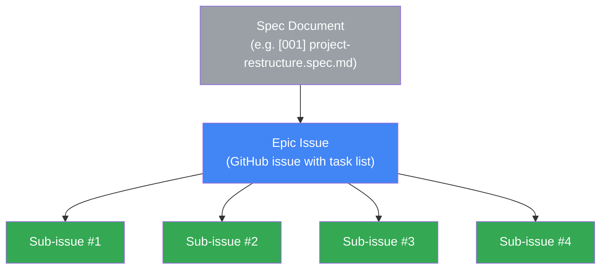
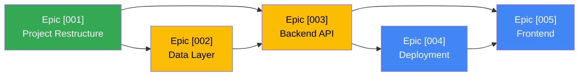

# Conventions — Issue & Spec Management

---

## Issue hierarchy



| Level | What | Example |
|-------|------|---------|
| **Spec** | A markdown document defining a body of work with scope, interfaces, and verification criteria | `[001] project-restructure.spec.md` |
| **Epic** | A GitHub issue that tracks all sub-issues for one spec. Contains a task list with links to sub-issues. | `Project Restructure & Core Extraction [001]` |
| **Sub-issue** | A single PR-able unit of work. Small enough to review in one sitting. | `Move nlp/ and parsing/ into core/` |

---

## Naming conventions

### Epic issues

```
<Title> [<spec-number>]
```

Examples:
- `Project Restructure & Core Extraction [001]`
- `Data Layer Abstraction [002]`
- `FastAPI Backend & Auth [003]`

### Sub-issues

```
[<spec-number>.<sequence>] <description>
```

Examples:
- `[001.1] Create core/ package structure`
- `[001.2] Move nlp/ and parsing/ into core/`
- `[002.3] Refactor repositories.py to implement interfaces`
- `[003.6] Feynman chat SSE streaming endpoint`

The spec number prefix makes it easy to find all issues related to a spec, even outside the epic's task list.

---

## Labels

| Label | Color | Purpose |
|-------|-------|---------|
| `epic` | `#4285f4` (blue) | Applied to epic issues only |
| `spec:001` | `#e8eaed` (gray) | Links sub-issues to their spec. One label per spec. |
| `spec:002` | `#e8eaed` | |
| `spec:003` | `#e8eaed` | |
| `spec:004` | `#e8eaed` | |
| `spec:005` | `#e8eaed` | |
| `blocked` | `#ea4335` (red) | Issue cannot proceed until a dependency is resolved |
| `migration` | `#fbbc04` (yellow) | Refactoring/moving existing code (no new features) |
| `infrastructure` | `#9334e6` (purple) | CI/CD, deployment, environment setup |

These are in addition to any existing labels in the repo.

---

## Epic issue template

```markdown
## <Title> [<spec-number>]

**Spec:** [link to spec document]

### Summary
<1-2 sentence description of what this epic delivers>

### Sub-issues
- [ ] #__ [<spec>.<seq>] <description>
- [ ] #__ [<spec>.<seq>] <description>
- [ ] #__ [<spec>.<seq>] <description>

### Depends on
- [ ] #__ <epic title> [<spec-number>] (if any)

### Verification criteria
<copied from the spec's verification criteria section>
```

### Workflow

1. **Create sub-issues first** — each gets the `spec:NNN` label
2. **Create the epic issue** — add the `epic` label, paste the task list linking to sub-issues
3. **Work sub-issues in order** — each gets its own branch and PR
4. **Close the epic** when all sub-issues are complete and verification criteria pass

---

## Branch naming

```
feat/<spec-number>.<sequence>-<short-description>
```

Examples:
- `feat/001.2-move-nlp-parsing`
- `feat/002.5-schema-migration-v9`
- `feat/003.6-feynman-sse-endpoint`

For epics that are small enough to do in a single PR (rare):
- `feat/001-project-restructure`

---

## PR conventions

### Title
```
feat: <description> (#<sub-issue-number>)
```

### Body
```markdown
## Summary
<what this PR does>

Closes #<sub-issue-number>

## Spec reference
docs/architecture-review/specs/[<NNN>] <name>.spec.md — Section <X>

## Test plan
- [ ] ...
```

Each sub-issue gets its own `Closes #X` line (per existing project convention — never comma-separated).

---

## Dependency tracking

Specs have declared dependencies (e.g., 003 depends on 001 and 002). At the issue level:

- Epic issues note their dependencies in a "Depends on" section
- Sub-issues within an epic can be worked in parallel unless they have intra-epic dependencies (noted in the spec's issue breakdown)
- Use the `blocked` label when a sub-issue is waiting on another


