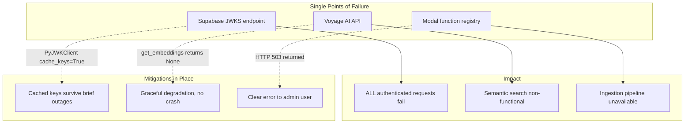

# Cloud Stack Analysis — Current Footprint, Alternatives, and Vendor Coupling

**Issue:** #221
**Date:** 2026-04-04
**Status:** Complete

---

## 1. Vendor Map

| Vendor | Role | Coupling Points | Lock-in | Top Alternatives |
|---|---|---|---|---|
| **Supabase** | PostgreSQL hosting, Auth (JWT/JWKS), RLS policies | `api/dependencies.py:33-43` (JWKS endpoint), `api/dependencies.py:63-99` (JWT validation, `audience: "authenticated"`), `web/lib/supabase/` (client + server SDKs), `web/proxy.ts` (session refresh + auth guard), `web/app/auth/` (OAuth callback, sign-in), `supabase/migrations/` (7 migration files, RLS policies) | **HIGH** | Neon + Clerk, Neon + Auth0, self-hosted Postgres + custom JWT |
| **Railway** | API hosting (container deployment) | `railway.toml` (build + deploy config), `api/Dockerfile` (standard Docker, not Railway-specific) | **LOW** | Fly.io, Render, Cloud Run, Vercel Functions |
| **Vercel** | Next.js frontend hosting | `web/vercel.json` (framework: nextjs), env vars (`NEXT_PUBLIC_VERCEL_URL` for CORS) | **LOW** | Netlify, Cloudflare Pages, self-hosted |
| **Modal** | Distributed compute (ingestion pipeline) | `pipeline/ingest.py` (app definition, `@app.function`, `modal.Secret`, `modal.Image`), `api/routes/admin.py:152-160` (dispatch via `modal.Function.from_name`) | **MEDIUM** | AWS Lambda + SQS, Cloud Run Jobs, Celery + any worker, Temporal |
| **Anthropic (Claude)** | LLM extraction + streaming analysis + competitor analysis | `services/llm.py:15` (SDK import), `services/llm.py:187-189` (model refs: `claude-sonnet-4-5`, `claude-haiku-4-5-20251001`), `services/llm.py:127-144` (investor signals streaming), `services/competitors.py:6,47-49` (competitor analysis) | **MEDIUM** | OpenAI, Google Gemini, any OpenAI-compatible API |
| **Perplexity** | Streaming Feynman chat + news fetching | `services/llm.py:31-124` (raw HTTP to `api.perplexity.ai`, model: `sonar-pro`), `services/recent_news.py:56-80` (news search, model: `sonar`) | **LOW** | Any OpenAI-compatible chat API, Anthropic streaming |
| **Voyage AI** | Finance-specialized embeddings | `nlp/embedder.py:10-33` (SDK, model: `voyage-finance-2`, 1024-dim vectors), `db/repositories/embeddings.py` (pgvector search with `vector(1024)`) | **MEDIUM** | OpenAI embeddings, Cohere embed, Jina; requires re-embedding all stored vectors |
| **API Ninjas** | Earnings transcript download | `pipeline/ingest.py:78-81` (single HTTP call) | **LOW** | Financial Modeling Prep, Alpha Vantage, direct SEC EDGAR |
| **Sentry** | Error monitoring (optional) | `api/main.py:69-84` (SDK init, optional) | **LOW** | Datadog, Bugsnag, self-hosted Sentry |
| **pgvector** | Vector similarity search (Postgres extension) | `supabase/migrations/20260329180609_remote_schema.sql:17` (`CREATE EXTENSION vector`), `db/repositories/embeddings.py:6,44-55` (`<=>` operator, `register_vector`) | **MEDIUM** | Pinecone, Weaviate, Qdrant (but loses co-location with relational data) |

---

## 2. Commodity vs. Strategic Classification

### Commodity (easily swapped)

| Vendor | Why Commodity |
|---|---|
| **Railway** | Standard Docker deployment. `railway.toml` is 5 lines. The `Dockerfile` is vanilla — works on any container platform. Switching = new deploy config + DNS. |
| **Vercel** | `vercel.json` is 1 line (`"framework": "nextjs"`). The only Vercel-specific touch is `NEXT_PUBLIC_VERCEL_URL` for CORS origin. Any Next.js host works. |
| **API Ninjas** | Single HTTP GET call in `pipeline/ingest.py:78-81`. Swapping = change the URL and response parser. |
| **Perplexity** | Raw HTTP SSE client, OpenAI-compatible protocol. Could point at any compatible endpoint with a URL + model name change. |
| **Sentry** | Optional, behind an env var check. Drop-in replaceable. |

### Strategic (meaningful coupling)

| Vendor | Why Strategic |
|---|---|
| **Supabase (Auth)** | JWT audience claim `"authenticated"` is baked into `api/dependencies.py:79`. The JWKS URL pattern (`/auth/v1/.well-known/jwks.json`) is Supabase-specific. The frontend has 3 Supabase SDK integration points (browser client, server client, proxy middleware) plus the OAuth callback route. RLS policies reference `auth.uid()` — a Supabase function. |
| **Supabase (Database)** | The migration system uses `supabase/migrations/` and the Supabase CLI. The transaction pooler connection string format (`pooler.supabase.com:6543`) is Supabase-specific. However, the SQL itself is standard PostgreSQL + pgvector — no proprietary Supabase SQL extensions beyond `auth.uid()` in RLS policies. |
| **Anthropic** | The `anthropic` Python SDK is used directly with Anthropic-specific features: `client.messages.stream()`, `message.usage.input_tokens`, model name format (`claude-*`). The prompt engineering in `ingestion/prompts.py` is tuned for Claude's instruction-following style. 6 distinct LLM call sites in `services/llm.py`. |
| **Voyage AI** | The `voyage-finance-2` model produces 1024-dimensional vectors. All stored embeddings are in this dimension. Switching embedding providers means re-embedding every span in the database and updating the `vector(1024)` column definition if the new model uses a different dimension. |
| **Modal** | The pipeline uses Modal-specific primitives: `modal.Image`, `modal.Secret.from_name()`, `@app.function()`, `modal.Function.from_name()` for remote dispatch. The API server (`admin.py`) imports `modal` directly to spawn jobs. |

---

## 3. Findings

### **[HIGH] Supabase auth is the deepest single-vendor coupling**

**Vendor(s):** Supabase
**File(s):**
- `api/dependencies.py:33-43` — JWKS client hardcoded to Supabase URL pattern
- `api/dependencies.py:74-79` — JWT decode with `audience="authenticated"` (Supabase-specific claim)
- `web/lib/supabase/client.ts` — Browser client using `@supabase/ssr`
- `web/lib/supabase/server.ts` — Server client using `@supabase/ssr`
- `web/proxy.ts:1-63` — Session refresh + auth guard via Supabase SDK
- `web/app/auth/sign-in/page.tsx:13` — `signInWithOAuth` via Supabase client
- `web/app/auth/callback/route.ts:17` — `exchangeCodeForSession` via Supabase client
- `supabase/migrations/20260330000003_rls_policies.sql` — RLS policies using `auth.uid()`
- `supabase/migrations/20260329180609_remote_schema.sql:286-308` — RLS policies

**Finding:** Auth touches every layer of the stack: the API server validates Supabase JWTs, the frontend uses the Supabase SDK for session management and OAuth, and the database uses `auth.uid()` in RLS policies. Additional coupling beyond the primary files listed above:
- `web/lib/admin-auth.ts` — server-side `auth.getUser()` + profile role check for admin routes
- `web/lib/chat.ts`, `web/lib/signals.ts` — `getSession()` to extract `access_token` for API calls
- `web/app/SignOutButton.tsx` — `supabase.auth.signOut()`
- `supabase/migrations/20260329180609_remote_schema.sql:262-277` — `handle_new_user()` trigger on `auth.users` INSERT that auto-creates profile rows
- `supabase/config.toml` — local auth server config (JWT expiry, OAuth redirect URLs)

Migrating off Supabase auth would require changes in ~15 files across 3 codebases (API, frontend, database migrations).

**Impact:** If Supabase auth experiences an outage, the JWKS endpoint becomes unreachable, and *all* authenticated API requests fail (the `PyJWKClient` has `cache_keys=True`, which provides some resilience for already-cached keys, but new keys or key rotations would fail). The frontend cannot sign users in or refresh sessions.

---

### **[HIGH] Embedding dimension lock-in to Voyage AI**

**Vendor(s):** Voyage AI, pgvector
**File(s):**
- `nlp/embedder.py:10` — `model="voyage-finance-2"` hardcoded as default
- `supabase/migrations/20260329180609_remote_schema.sql:63` — `embedding vector(1024)` column definition
- `db/repositories/embeddings.py:39-55` — Cosine distance search (`<=>` operator)

**Finding:** The `voyage-finance-2` model produces 1024-dimensional vectors. This dimension is baked into the database schema. Switching to a different embedding provider (OpenAI = 1536 or 3072 dim, Cohere = 1024, Jina = 768) would require: (1) altering the column type, (2) re-embedding every stored span, and (3) updating the embedder code. The re-embedding cost scales linearly with corpus size.

**Impact:** The longer the system runs and the more transcripts it ingests, the more expensive a provider switch becomes. This is a progressively deepening lock-in.

---

### **[HIGH] Modal dispatch is tightly coupled into the API server**

**Vendor(s):** Modal
**File(s):**
- `api/routes/admin.py:10` — `import modal`
- `api/routes/admin.py:152-160` — `modal.Function.from_name("earnings-ingestion", "ingest_ticker")`, `fn.spawn.aio()`
- `api/routes/admin.py:154-159` — Modal-specific exception types (`NotFoundError`, `AuthError`, `Error`)
- `pipeline/ingest.py:8,46-65` — Full Modal image + app definition
- `api/settings.py:14` — `MODAL_TOKEN_ID` in required env vars

**Finding:** The API server directly imports the Modal SDK to dispatch ingestion jobs. This means `modal` is a runtime dependency of the API, not just the pipeline. If Modal is unreachable, the ingestion endpoint returns 503. The `modal.Function.from_name()` pattern tightly couples the API to Modal's function registry.

**Impact:** Cannot run the API server without a valid `MODAL_TOKEN_ID`. Cannot dispatch ingestion jobs without a deployed Modal app. Testing the admin endpoint requires mocking Modal at multiple levels.

---

### **[MEDIUM] Anthropic SDK usage is direct, not abstracted**

**Vendor(s):** Anthropic
**File(s):**
- `services/llm.py:15` — `import anthropic`
- `services/llm.py:136-144` — `client.messages.stream()` (streaming)
- `services/llm.py:187-189` — Model names: `claude-sonnet-4-5`, `claude-haiku-4-5-20251001`
- `services/llm.py:247-252,267-271,284-289,303-308,321-326,347-352` — 6 `client.messages.create()` call sites
- `services/competitors.py:6,47-49` — Separate Anthropic client for competitor analysis (`claude-haiku-4-5-20251001`)
- `core/models.py:19-36` — Hardcoded pricing table for Claude models (used for cost attribution)

**Finding:** All LLM extraction (tiers 1-3, NLP synthesis, brief synthesis, Q&A detection), streaming analysis, and competitor analysis use the Anthropic SDK directly. The `AgenticExtractor` class is an Anthropic client wrapper, not a provider-agnostic interface. Switching to a different LLM would require rewriting or wrapping all 7+ call sites across two service files, plus updating the pricing table.

**Impact:** Manageable — the Anthropic SDK's request/response format is similar to OpenAI's. The bigger risk is prompt compatibility: the extraction prompts in `ingestion/prompts.py` are tuned for Claude's instruction-following behavior.

---

### **[MEDIUM] Supabase database is standard Postgres under the hood**

**Vendor(s):** Supabase (database layer)
**File(s):**
- `api/dependencies.py:45-60` — `psycopg.connect()` with standard `DATABASE_URL`
- `db/repositories/` — All queries use standard SQL + psycopg3
- `supabase/migrations/` — Standard PostgreSQL DDL + pgvector extension

**Finding:** The database coupling to Supabase is *lower* than it appears. The app uses `psycopg3` directly — not the Supabase client SDK for data access. All SQL is standard PostgreSQL. The Supabase-specific SQL is: `auth.uid()` in RLS policies, `handle_new_user()` trigger on `auth.users` for auto-provisioning profiles, and `pg_cron` scheduled jobs for data retention cleanup (`supabase/migrations/20260330000001_retention_cleanup.sql`). The migration toolchain (`supabase/migrations/` + Supabase CLI) is Supabase-specific but migrations are plain `.sql` files that would work with any PostgreSQL migration tool.

**Impact:** Migrating the database to Neon, RDS, or self-hosted Postgres would primarily require: (1) rewriting RLS policies to remove `auth.uid()` references, (2) replacing the `auth.users` trigger with an application-level user-provisioning hook, (3) replacing `pg_cron` with an external scheduler or the target platform's equivalent, (4) switching the migration CLI (e.g., to Alembic or raw `psql`), (5) updating connection strings. The data access layer (`db/repositories/`) would need zero changes.

---

### **[MEDIUM] Single embedding provider creates a single point of failure**

**Vendor(s):** Voyage AI
**File(s):**
- `nlp/embedder.py:23-33` — Single API key, single client
- `api/settings.py:11` — `VOYAGE_API_KEY` is a required env var

**Finding:** Semantic search (`/search` endpoint) is entirely dependent on Voyage AI's API availability. There is no fallback embedding provider. If Voyage's API is down, search degrades silently (returns `None` from `get_embeddings`).

**Impact:** Search is non-functional during any Voyage outage. The `voyage-finance-2` model is specialized for financial text, so generic alternatives may produce lower-quality results.

---

### **[LOW] Railway coupling is negligible**

**Vendor(s):** Railway
**File(s):**
- `railway.toml` — 5-line build/deploy config
- `api/Dockerfile` — Standard Docker, no Railway-specific commands

**Finding:** The `Dockerfile` is a vanilla Python 3.12 image with pip install + uvicorn. `railway.toml` only specifies the Dockerfile path, start command, and health check path. This would work on any Docker-hosting platform with at most a config file rename.

**Impact:** Migration effort: ~30 minutes (write equivalent config for target platform, update DNS).

---

### **[LOW] Vercel coupling is minimal**

**Vendor(s):** Vercel
**File(s):**
- `web/vercel.json` — `{"framework": "nextjs"}`
- `api/main.py:146` — `NEXT_PUBLIC_VERCEL_URL` for CORS origins

**Finding:** The frontend is a standard Next.js app. The only Vercel-specific artifact is the 1-line `vercel.json` and the CORS env var name. Deploying to any other Next.js host (Netlify, Cloudflare Pages) requires only adjusting the deployment config and CORS env var.

**Impact:** Migration effort: ~1 hour.

---

### **[LOW] Perplexity is used via raw HTTP, not SDK**

**Vendor(s):** Perplexity
**File(s):**
- `services/llm.py:31-124` — Raw `requests.post()` to `https://api.perplexity.ai/chat/completions` (Feynman chat, model: `sonar-pro`)
- `services/recent_news.py:56-80` — Raw HTTP to same endpoint (news fetching, model: `sonar`)

**Finding:** Both the Feynman chat and news fetching use the OpenAI-compatible chat completions protocol over raw HTTP. No SDK dependency. Switching to any OpenAI-compatible provider (Anthropic Messages API, OpenAI, Groq, Together, local Ollama) would require changing the URL, API key header, and potentially the model name. The SSE parsing logic is protocol-standard.

**Impact:** Migration effort: change URL, auth header, and model name in 2 files.

---

## 4. Cloud Agnosticity Assessment

### Scenario: Move off Supabase entirely (auth + DB)

| What breaks | Files affected | Effort |
|---|---|---|
| JWKS validation endpoint | `api/dependencies.py:33-43` | Rewrite `_get_jwks_client()` for new auth provider's JWKS URL |
| JWT audience claim | `api/dependencies.py:79` | Change `audience="authenticated"` to new provider's claim |
| Frontend auth SDK (browser + server + proxy) | `web/lib/supabase/client.ts`, `web/lib/supabase/server.ts`, `web/proxy.ts` | Replace `@supabase/ssr` with new auth SDK (e.g., Clerk, Auth0) |
| OAuth sign-in + callback | `web/app/auth/sign-in/page.tsx`, `web/app/auth/callback/route.ts` | Rewrite with new auth provider's flow |
| Token extraction in API wrappers | `web/lib/chat.ts`, `web/lib/signals.ts`, `web/lib/admin-auth.ts` | Replace `getSession()` pattern with new auth token retrieval |
| Sign-out | `web/app/SignOutButton.tsx` | Replace `supabase.auth.signOut()` |
| User provisioning trigger | `supabase/migrations/...remote_schema.sql:267-277` | Replace `auth.users` trigger with app-level user creation hook |
| RLS policies | `supabase/migrations/20260330000003_rls_policies.sql` | Remove `auth.uid()` references; enforce at app layer or rewrite |
| `pg_cron` retention jobs | `supabase/migrations/20260330000001_retention_cleanup.sql` | Replace with external scheduler or target platform's cron |
| Connection string format | `api/.env.example` | Update to new provider's connection string |
| Migration toolchain | `supabase/` directory | Switch to Alembic, Flyway, or raw SQL migration tool |
| **Total** | **~15 files** | **~3-4 days for auth, ~1 day for DB migration toolchain** |

### Scenario: Move off Modal

| What breaks | Files affected | Effort |
|---|---|---|
| Pipeline job definition | `pipeline/ingest.py` | Rewrite as Lambda function, Cloud Run Job, or Celery task |
| API dispatch | `api/routes/admin.py:150-160` | Replace `modal.Function.from_name()` with new dispatch mechanism |
| Required env var | `api/settings.py:14` | Replace `MODAL_TOKEN_ID` with new credential |
| **Total** | **3 files** | **~1-2 days** |

### Scenario: Move off Railway

| What breaks | Files affected | Effort |
|---|---|---|
| Deploy config | `railway.toml` | Write equivalent for target (e.g., `fly.toml`, `render.yaml`) |
| **Total** | **1 file** | **~30 minutes** |

---

## 5. Single Points of Failure and Risk Concentrations



**Risk concentration:** Supabase carries the highest concentration — it provides both authentication *and* the database. An extended Supabase outage would make the app entirely non-functional (no auth = no API access; no DB = no data).

---

## 6. What a Cloud-Agnostic Abstraction Layer Would Look Like

This is not a migration plan. These are the interfaces that, if introduced, would reduce vendor coupling the most per unit of effort.

### Priority 1: Auth Provider Interface

**Why:** Supabase auth is the deepest coupling. An interface here decouples both the API and the frontend.

```python
# core/auth.py — hypothetical
class AuthProvider(Protocol):
    def get_jwks_url(self) -> str: ...
    def get_expected_audience(self) -> str: ...
    def decode_token(self, token: str) -> dict: ...

class SupabaseAuth:
    """Current implementation — wraps existing logic from dependencies.py."""
    ...
```

On the frontend, this would mean creating a provider-agnostic auth context that wraps whichever SDK is in use (Supabase, Clerk, Auth0).

**Coupling reduced:** `api/dependencies.py`, `web/lib/supabase/`, `web/proxy.ts`, `web/app/auth/`

### Priority 2: Embedding Provider Interface

**Why:** Progressively deepening lock-in. The interface is simple (texts in, vectors out) but the dimension dependency makes it expensive to defer.

```python
# core/embeddings.py — hypothetical
class EmbeddingProvider(Protocol):
    @property
    def dimension(self) -> int: ...
    def embed(self, texts: list[str]) -> list[list[float]]: ...

class VoyageEmbedder:
    dimension = 1024
    ...
```

**Coupling reduced:** `nlp/embedder.py`, `db/repositories/embeddings.py`, migration schema

### Priority 3: Job Dispatch Interface

**Why:** Decouples the API from Modal, enabling local testing and alternative compute backends.

```python
# core/jobs.py — hypothetical
class JobDispatcher(Protocol):
    async def dispatch(self, job_name: str, **kwargs) -> str: ...

class ModalDispatcher:
    """Current implementation — wraps modal.Function.from_name()."""
    ...
```

**Coupling reduced:** `api/routes/admin.py`, `pipeline/ingest.py`

### Priority 4: LLM Provider Interface

**Why:** Lower priority because the Anthropic SDK's interface is close to a de-facto standard, but an abstraction would enable model A/B testing and provider fallback.

**Coupling reduced:** `services/llm.py` (all 7 call sites)

---

## 7. Recommended Next Steps

1. **No immediate action required.** The current stack is functional, and the coupling points are well-understood from this analysis. None of the lock-in risks are urgent.

2. **If pursuing cloud-agnosticism**, the highest-ROI first step would be an **auth provider interface** (Priority 1 above). This is the deepest coupling, the hardest to change later, and the only one that spans all three codebases. Scope: a follow-on spike to design the interface and estimate migration effort for Supabase Auth → Clerk or Auth0.

3. **Consider embedding dimension strategy** before the corpus grows significantly larger. If the team anticipates potentially switching embedding providers, introducing the embedding interface *now* (when the corpus is small) avoids a costly re-embedding migration later. This could be as lightweight as extracting the dimension constant and the `embed()` call behind a protocol.

4. **Decouple Modal from the API server** if local development or testing friction increases. The current pattern (API imports `modal` directly) means the API can't run without a valid Modal token. A job dispatcher interface would enable a local in-process fallback for development.
