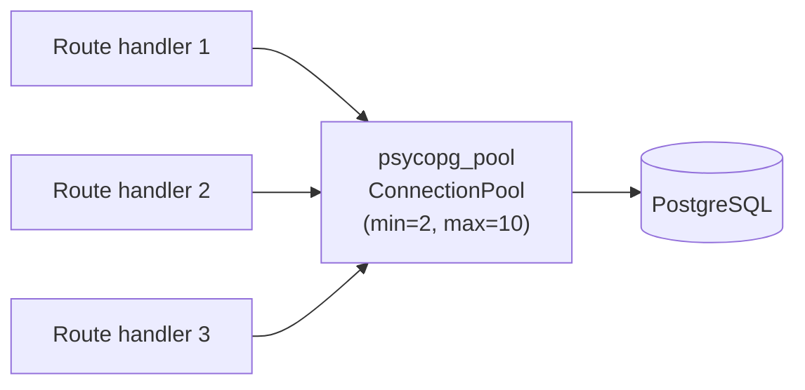

# S2 — Data Layer Abstraction

*Status: Draft*
*Depends on: S1 (core/ extraction)*
*Estimated issues: 5-7*

---

## Goal

Extract abstract repository interfaces from the current concrete PostgreSQL implementations. Add user_id scoping to support multi-tenancy. Introduce connection pooling for production readiness. At the end of this spec, the data layer has clean interfaces that a future non-Postgres backend could implement, and all user-scoped data is isolated by Firebase UID.

---

## Why this is second

S1 moves `db/` into `core/db/`. This spec refactors what's inside it. The FastAPI backend (S3) needs these interfaces to inject repositories into route handlers, and user_id scoping is required before any authenticated API can read/write data correctly.

---

## Scope

### In scope
- Define abstract repository interfaces (`core/db/interfaces.py`)
- Refactor `repositories.py` into a Postgres implementation of those interfaces
- Add `user_id` parameter to all user-scoped operations
- Add connection pooling (psycopg connection pool)
- Update schema: add `user_id` column to `learning_sessions` and `transcript_progress`
- Migration script for the schema changes

### Out of scope
- Implementing a non-Postgres backend (the interface enables it; we don't build it yet)
- Changing API endpoints (that's S3)
- Firebase Auth integration (that's S3 — here we just accept `user_id: str` as a parameter)

---

## Interface design

```mermaid
classDiagram
    class CallRepository {
        <<interface>>
        +get_all_calls() list[CallSummary]
        +get_company_info(ticker) tuple[str, str]
        +get_call_date(ticker) date | None
    }

    class AnalysisRepository {
        <<interface>>
        +get_summary(ticker) str | None
        +get_takeaways(ticker, limit) list[Takeaway]
        +get_themes(ticker) list[str]
        +get_synthesis(ticker) SynthesisData | None
        +get_speakers(ticker) list[Speaker]
        +get_speaker_dynamics(ticker) list[SpeakerDynamic]
        +get_terms(ticker, category) list[Term]
        +get_strategic_shifts(ticker) list[StrategicShift] | None
        +get_evasion(ticker) list[EvasionEntry]
        +get_misconceptions(ticker) list[Misconception]
        +get_spans(ticker) list[Span]
        +get_keywords(ticker, limit) list[str]
        +save_analysis(result: CallAnalysis) None
    }

    class LearningRepository {
        <<interface>>
        +save_session(user_id, ticker, session) bool
        +get_sessions(user_id, ticker) list[Session]
        +get_stats(user_id) LearningStats
        +get_ticker_session_counts(user_id) list[TickerCount]
    }

    class ProgressRepository {
        <<interface>>
        +mark_step_viewed(user_id, ticker, step) None
        +get_completed_steps(user_id, ticker) set[int]
        +get_all_step_counts(user_id) list[TickerSteps]
    }

    class EmbeddingRepository {
        <<interface>>
        +fetch_existing(ticker, quarter) dict[str, list[float]]
        +search_spans(ticker, query_vector, top_k) list[str]
    }

    class CompetitorRepository {
        <<interface>>
        +get(ticker) list[Competitor]
        +save(ticker, competitors) None
        +delete(ticker) None
    }

    class PostgresCallRepo {
        -pool: ConnectionPool
    }
    class PostgresAnalysisRepo {
        -pool: ConnectionPool
    }
    class PostgresLearningRepo {
        -pool: ConnectionPool
    }

    CallRepository <|.. PostgresCallRepo
    AnalysisRepository <|.. PostgresAnalysisRepo
    LearningRepository <|.. PostgresLearningRepo
    ProgressRepository <|.. PostgresProgressRepo
    EmbeddingRepository <|.. PostgresEmbeddingRepo
    CompetitorRepository <|.. PostgresCompetitorRepo
```



### Key changes from current code

1. **All repository methods use a shared connection pool** instead of opening/closing connections per call
2. **`user_id: str` parameter added** to LearningRepository and ProgressRepository methods
3. **Return types are typed dataclasses/NamedTuples** instead of raw tuples (e.g., `list[tuple[str, str, str]]` → `list[Term]`)
4. **Interfaces are abstract base classes** using Python's `abc.ABC` + `@abstractmethod`

---

## User_id scoping

### What gets scoped

| Table | Current user_id | Change |
|-------|----------------|--------|
| `learning_sessions` | Hardcoded `SYSTEM_USER_ID` | Real Firebase UID |
| `transcript_progress` | None (implicit single user) | Add `user_id` column |
| `concept_exercises` | Via `learning_sessions.session_id` | Inherited — no change |

### What stays unscoped

Calls, analysis, spans, terms, evasion, etc. are **shared data** — all users see the same analyzed transcripts. Only learning progress is per-user.

### Schema migration (v8 → v9)

```sql
-- Add user_id to transcript_progress
ALTER TABLE transcript_progress ADD COLUMN user_id TEXT;

-- Backfill existing rows with the system user
UPDATE transcript_progress SET user_id = '00000000-0000-0000-0000-000000000001'
WHERE user_id IS NULL;

-- Make it NOT NULL after backfill
ALTER TABLE transcript_progress ALTER COLUMN user_id SET NOT NULL;

-- Drop the old unique constraint and create a new one including user_id
ALTER TABLE transcript_progress DROP CONSTRAINT IF EXISTS transcript_progress_call_id_step_number_key;
ALTER TABLE transcript_progress ADD CONSTRAINT transcript_progress_user_call_step_key
    UNIQUE (user_id, call_id, step_number);

-- Update learning_sessions.user_id from UUID to TEXT (Firebase UIDs are strings)
ALTER TABLE learning_sessions ALTER COLUMN user_id TYPE TEXT;
```

---

## Connection pooling

### Current problem

Every repository method calls `psycopg.connect(conn_str)`, opens a connection, runs a query, and closes it. This is fine for local development but creates connection churn under load.

### Solution



Use `psycopg_pool.ConnectionPool` (built into psycopg 3). The pool is created once at app startup and injected into repositories via FastAPI dependency injection (S3 concern) or passed directly for Streamlit/CLI use.

### Backward compatibility

For local/CLI use, the repositories accept either a connection pool or a connection string. If given a string, they fall back to the current connect-per-call behavior. This keeps Streamlit and CLI working without changes.

---

## Return type cleanup

Replace raw tuple returns with typed objects. Examples:

```python
# Before (current)
def get_speakers_for_ticker(self, ticker: str) -> list[tuple[str, str, str | None, str | None]]:

# After
@dataclass(frozen=True)
class Speaker:
    name: str
    role: str
    title: str | None
    firm: str | None

def get_speakers(self, ticker: str) -> list[Speaker]:
```

These typed return objects go in `core/models.py` alongside the existing dataclasses. They serve double duty: the repository returns them, and FastAPI serializes them directly to JSON responses (S3).

---

## Verification criteria

- [ ] All 6 repository interfaces defined in `core/db/interfaces.py`
- [ ] Postgres implementations pass the existing test suite
- [ ] `user_id` parameter present on all learning/progress operations
- [ ] Schema migration script works (v8 → v9)
- [ ] Connection pool mode works with FastAPI (integration test)
- [ ] Connection string fallback works with Streamlit and CLI
- [ ] No raw tuple returns remain in repository interfaces

---

## Issue breakdown

### Epic: Data Layer Abstraction [002]

**Depends on:** Epic [001] (core extraction must be complete)

| Sub-issue | Title | Description | Depends on |
|-----------|-------|-------------|------------|
| `[002.1]` | Define repository interfaces in `core/db/interfaces.py` | ABC + abstractmethod for all 6 repositories with typed return values | — |
| `[002.2]` | Add typed return dataclasses to `core/models.py` | Speaker, Term, Takeaway, EvasionEntry, Misconception, etc. | — |
| `[002.3]` | Refactor `repositories.py` to implement interfaces | Rename to `postgres.py`, implement interfaces, replace raw tuples | 002.1, 002.2 |
| `[002.4]` | Add connection pooling | `psycopg_pool.ConnectionPool` with fallback for non-pooled use | 002.3 |
| `[002.5]` | Schema migration: user_id scoping | Migration v8→v9, update learning/progress repos to accept user_id | 002.3 |
| `[002.6]` | Update Streamlit `data_loaders.py` and CLI for new return types | Adapt callers to typed return objects | 002.3 |
| `[002.7]` | Integration tests for pooled repositories | Test pool lifecycle, concurrent access, fallback mode | 002.4 |

> 002.1 and 002.2 can be worked in parallel. 002.4 and 002.5 can be worked in parallel after 002.3.

See [conventions.md](../conventions.md) for epic/sub-issue naming and workflow.
