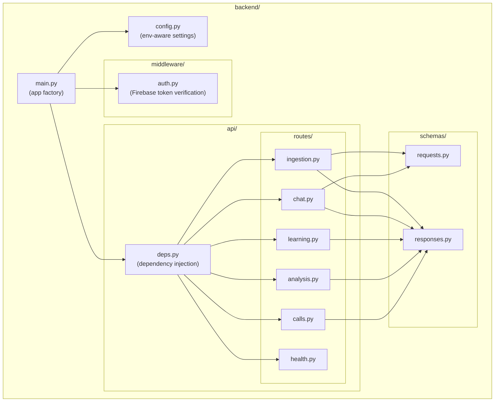
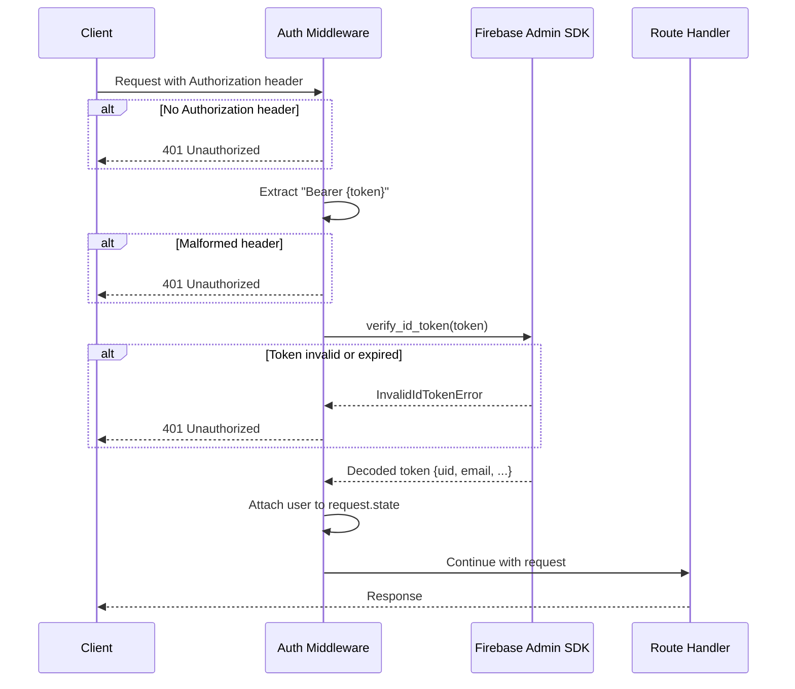
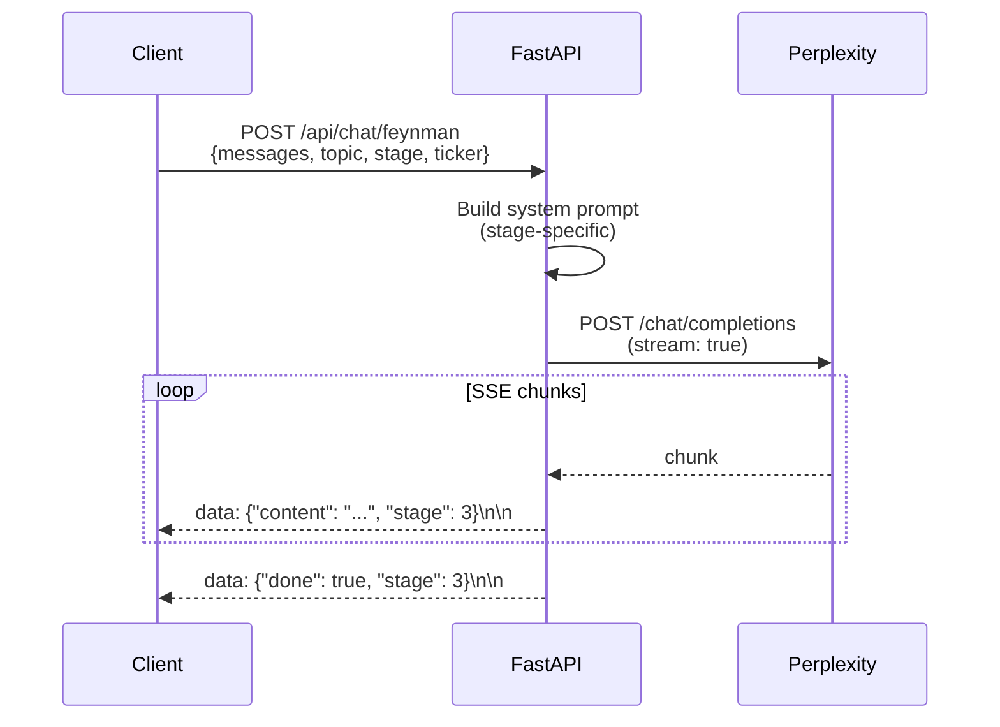
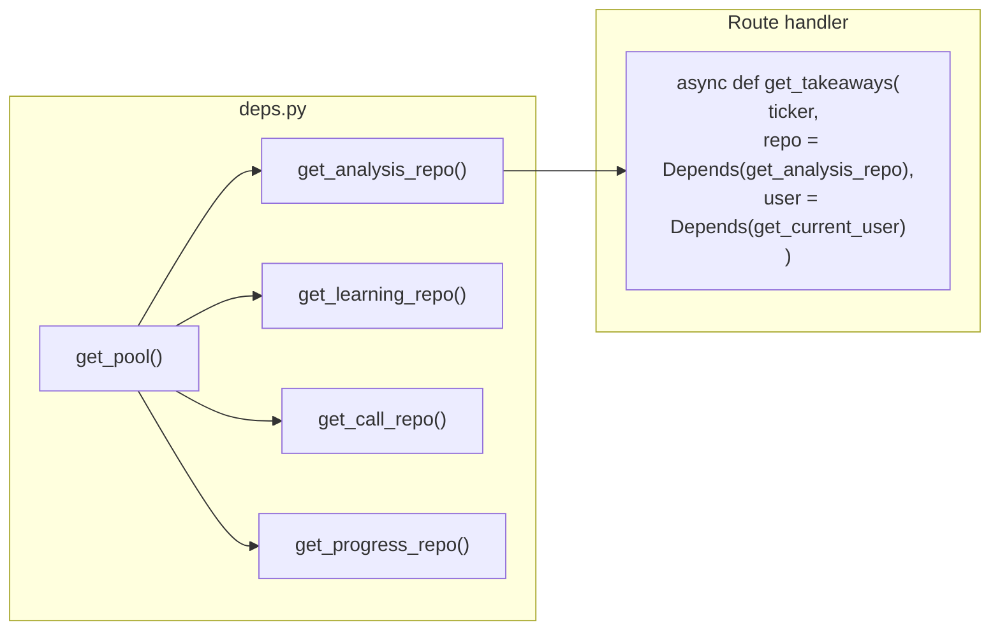

# 003 — FastAPI Backend & Auth

*Status: Draft*
*Depends on: 001 (core extraction), 002 (data layer abstraction)*
*Estimated issues: 8-12*

---

## Implementation status

**Status:** Implemented (with significant divergence from spec)

**Implemented via:** Multiple PRs. Auth bypass fixed in #212.

**What was built:**
- FastAPI application at `api/` (not `backend/` as spec'd)
- Auth middleware uses Supabase JWT verification (not Firebase Admin SDK) — `api/dependencies.py` provides `CurrentUserDep` and `RequireAdminDep`
- Routes at `api/routes/`: `calls.py` (call library + all analysis endpoints), `chat.py` (Feynman SSE streaming), `admin.py` (health check + ingestion trigger)
- Dependency injection via `api/dependencies.py` (`DbDep`, `CurrentUserDep`, `RequireAdminDep`)
- Pydantic response models on all endpoints
- Rate limiting via `slowapi` (was out of scope in spec; delivered anyway)
- JSON structured logging, Sentry integration, graceful shutdown
- Ingestion dispatched to Modal (not an inline long-running FastAPI endpoint)
- `api/Dockerfile` present

**Remaining / diverged:**
- `backend/` directory structure from spec was not used — everything lives in `api/`
- Firebase Admin SDK replaced by Supabase JWT — local dev bypass pattern differs from spec
- Separate `analysis.py` route file from spec was not created; analysis endpoints live in `calls.py`
- `learning.py` and `progress.py` route files were not created as separate files; learning/progress endpoints may be absent or consolidated
- `GET /api/calls/{ticker}/news` and `/competitors` endpoints: verify current state
- OpenAPI docs available at `/docs` (FastAPI default)

---

## Goal

Stand up a FastAPI application that exposes the full API surface defined in the target architecture, with Firebase Auth middleware protecting all endpoints. At the end of this spec, a developer can run the backend locally and exercise every endpoint via curl or an API client — no frontend required.

---

## Why this is third

The FastAPI routes delegate to `core/` services (from 001) and inject repository instances (from 002). Without those in place, the backend would either duplicate logic or have no data layer to talk to.

---

## Scope

### In scope
- `backend/` directory structure with FastAPI app factory
- Firebase Auth middleware (token verification)
- All read endpoints (learning path data)
- All learning/progress endpoints
- Feynman chat SSE streaming endpoint
- Ingestion endpoint (internal, not UI-exposed)
- Health check endpoint
- CORS configuration
- Request/response Pydantic schemas
- OpenAPI documentation (automatic via FastAPI)
- Backend-specific `requirements.txt` and `Dockerfile`

### Out of scope
- Deployment to Cloud Run (that's 004)
- React frontend (that's 005)
- Rate limiting (future enhancement)
- WebSocket alternative to SSE (not needed yet)

---

## Application structure



---

## Authentication middleware

### Flow



### Implementation notes

- Use `firebase-admin` Python SDK for token verification
- Initialize Firebase Admin at app startup: `firebase_admin.initialize_app()`
- In local dev with `ETT_ENV=local`, optionally bypass auth or accept a dev token (configurable, never in production)
- Excluded paths: `GET /api/health` (no auth required)

### User context

```python
# Available in any route handler via dependency injection
async def get_current_user(request: Request) -> UserContext:
    """Extract the authenticated user from the request."""
    return request.state.user  # Set by auth middleware

@dataclass
class UserContext:
    uid: str        # Firebase UID
    email: str      # User's email
```

---

## API Routes

### Calls & Analysis (read-only)

| Method | Path | Handler | Response Schema |
|--------|------|---------|-----------------|
| GET | `/api/calls` | `calls.list_calls` | `list[CallSummary]` |
| GET | `/api/calls/{ticker}` | `calls.get_call` | `CallDetail` |
| GET | `/api/calls/{ticker}/summary` | `analysis.get_summary` | `CallSummaryText` |
| GET | `/api/calls/{ticker}/takeaways` | `analysis.get_takeaways` | `list[Takeaway]` |
| GET | `/api/calls/{ticker}/themes` | `analysis.get_themes` | `list[str]` |
| GET | `/api/calls/{ticker}/synthesis` | `analysis.get_synthesis` | `SynthesisData` |
| GET | `/api/calls/{ticker}/speakers` | `analysis.get_speakers` | `list[Speaker]` |
| GET | `/api/calls/{ticker}/speaker-dynamics` | `analysis.get_speaker_dynamics` | `list[SpeakerDynamic]` |
| GET | `/api/calls/{ticker}/terms?category=financial` | `analysis.get_terms` | `list[Term]` |
| GET | `/api/calls/{ticker}/strategic-shifts` | `analysis.get_strategic_shifts` | `list[StrategicShift]` |
| GET | `/api/calls/{ticker}/evasion` | `analysis.get_evasion` | `list[EvasionEntry]` |
| GET | `/api/calls/{ticker}/misconceptions` | `analysis.get_misconceptions` | `list[Misconception]` |
| GET | `/api/calls/{ticker}/spans` | `analysis.get_spans` | `list[Span]` |
| GET | `/api/calls/{ticker}/keywords` | `analysis.get_keywords` | `list[str]` |
| GET | `/api/calls/{ticker}/competitors` | `analysis.get_competitors` | `list[Competitor]` |
| GET | `/api/calls/{ticker}/news` | `analysis.get_news` | `list[NewsItem]` |

### Learning & Progress (user-scoped)

| Method | Path | Handler | Notes |
|--------|------|---------|-------|
| GET | `/api/learning/sessions/{ticker}` | `learning.get_sessions` | Scoped to `user.uid` |
| POST | `/api/learning/sessions` | `learning.save_session` | Creates/updates session |
| GET | `/api/learning/stats` | `learning.get_stats` | User's global stats |
| GET | `/api/learning/progress/{ticker}` | `learning.get_progress` | Steps completed |
| POST | `/api/learning/progress/{ticker}/{step}` | `learning.mark_step` | Mark step viewed |

### Chat (SSE streaming)

| Method | Path | Handler | Notes |
|--------|------|---------|-------|
| POST | `/api/chat/feynman` | `chat.feynman_stream` | Returns `text/event-stream` |



### Internal (not UI-exposed)

| Method | Path | Handler | Notes |
|--------|------|---------|-------|
| POST | `/api/ingest/{ticker}` | `ingestion.ingest` | Long-running (30-60s) |
| PUT | `/api/calls/{ticker}/terms/{term}` | `analysis.update_term` | Term definition editing |
| GET | `/api/health` | `health.check` | No auth required |

---

## Dependency injection

FastAPI's `Depends()` system wires repositories and user context into route handlers.



This keeps route handlers thin — they validate input, call a repository or service method, and return a response schema. No business logic in routes.

---

## Response schemas (Pydantic)

Example schemas derived from the typed return objects in 002:

```python
class CallSummary(BaseModel):
    ticker: str
    fiscal_quarter: str | None
    company_name: str | None
    call_date: str | None

class Takeaway(BaseModel):
    takeaway: str
    why_it_matters: str

class EvasionEntry(BaseModel):
    analyst_name: str | None
    question_topic: str | None
    question_text: str | None
    answer_text: str | None
    analyst_concern: str
    defensiveness_score: int
    evasion_explanation: str

class SynthesisData(BaseModel):
    overall_sentiment: str
    executive_tone: str
    analyst_sentiment: str
    call_summary: str | None

class LearningStats(BaseModel):
    tickers_studied: int
    total_sessions: int
    completed_sessions: int
```

> Full schemas will be auto-documented via FastAPI's `/docs` (Swagger UI) and `/redoc` endpoints.

---

## Local development

### Running the backend

```bash
# From project root
source .venv/bin/activate
source set_env.sh
uvicorn backend.main:app --reload --port 8000
```

### Local auth bypass

When `ETT_ENV=local`, the auth middleware accepts a configurable dev token or skips verification entirely. This allows `curl` testing without Firebase:

```bash
# With dev bypass enabled
curl localhost:8000/api/calls

# With a real Firebase token (works in all environments)
curl -H "Authorization: Bearer $(firebase auth:token)" localhost:8000/api/calls
```

---

## Verification criteria

- [ ] `uvicorn backend.main:app` starts without errors
- [ ] `/api/health` returns 200 without authentication
- [ ] All read endpoints return correct data for an ingested ticker
- [ ] All read endpoints return 401 without a valid token (when auth is enabled)
- [ ] `/api/chat/feynman` streams SSE chunks to curl
- [ ] `/api/ingest/{ticker}` triggers the full pipeline and returns a call_id
- [ ] `/api/learning/*` endpoints scope data by user_id
- [ ] OpenAPI docs render at `/docs`
- [ ] All existing `pytest` tests still pass

---

## Issue breakdown

### Epic: FastAPI Backend & Auth [003]

**Depends on:** Epic [001] (core extraction), Epic [002] (data layer abstraction)

| Sub-issue | Title | Description | Depends on |
|-----------|-------|-------------|------------|
| `[003.1]` | Scaffold `backend/` directory with FastAPI app factory | `main.py`, `config.py`, `requirements.txt`, basic app structure | — |
| `[003.2]` | Pydantic response schemas | All request/response models, validated against existing data | — |
| `[003.3]` | Firebase Auth middleware | Token verification, user context extraction, local dev bypass | 003.1 |
| `[003.4]` | Dependency injection for repositories | `deps.py` with pool management and repo factories | 003.1 |
| `[003.5]` | Call & analysis read routes | All `GET /api/calls/*` endpoints wired to repos | 003.2, 003.3, 003.4 |
| `[003.6]` | Learning & progress routes | User-scoped CRUD endpoints | 003.3, 003.4 |
| `[003.7]` | Feynman chat SSE streaming endpoint | `POST /api/chat/feynman` with Perplexity streaming passthrough | 003.3 |
| `[003.8]` | Ingestion endpoint | `POST /api/ingest/{ticker}`, long-running, not UI-exposed | 003.3, 003.4 |
| `[003.9]` | Backend Dockerfile | Multi-stage build, production-ready | 003.1 |
| `[003.10]` | API integration tests | Test each route group against a test database | 003.5, 003.6, 003.7, 003.8 |

> 003.1 and 003.2 can be worked in parallel (schemas don't need the app factory). 003.3 and 003.4 can be worked in parallel after 003.1. 003.5 through 003.8 can be worked in parallel once their shared dependencies are merged. 003.9 can start anytime after 003.1.

See [conventions.md](../conventions.md) for epic/sub-issue naming and workflow.
