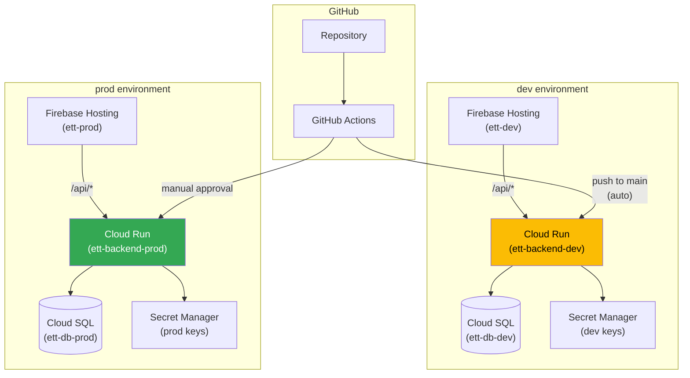
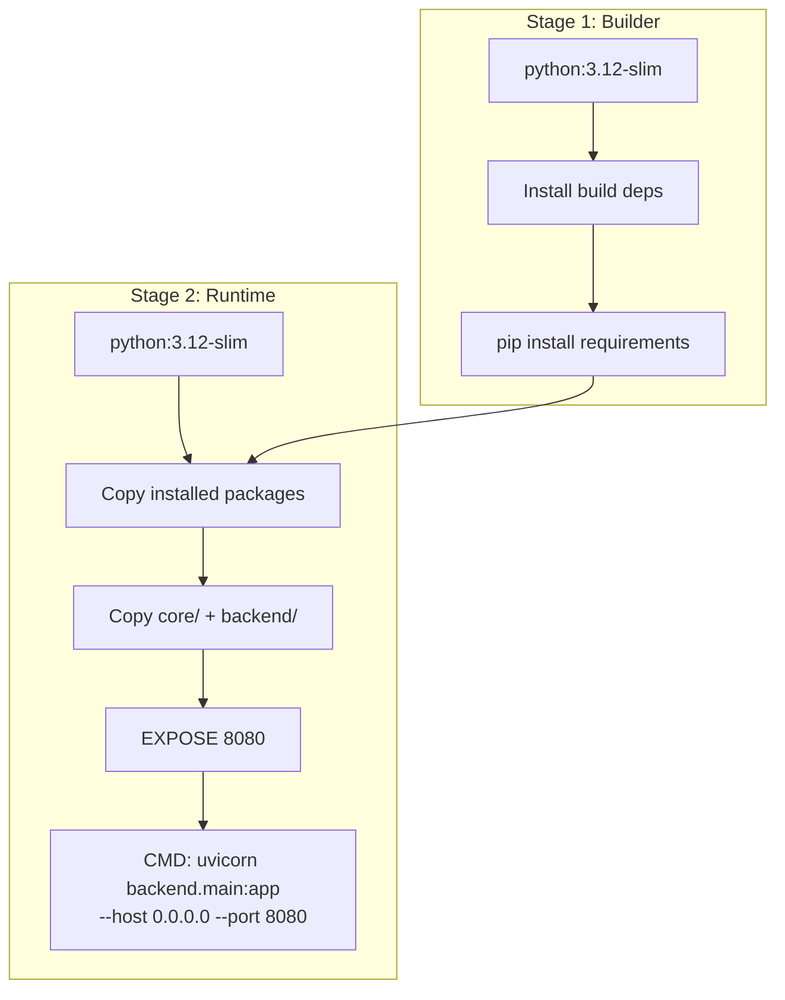
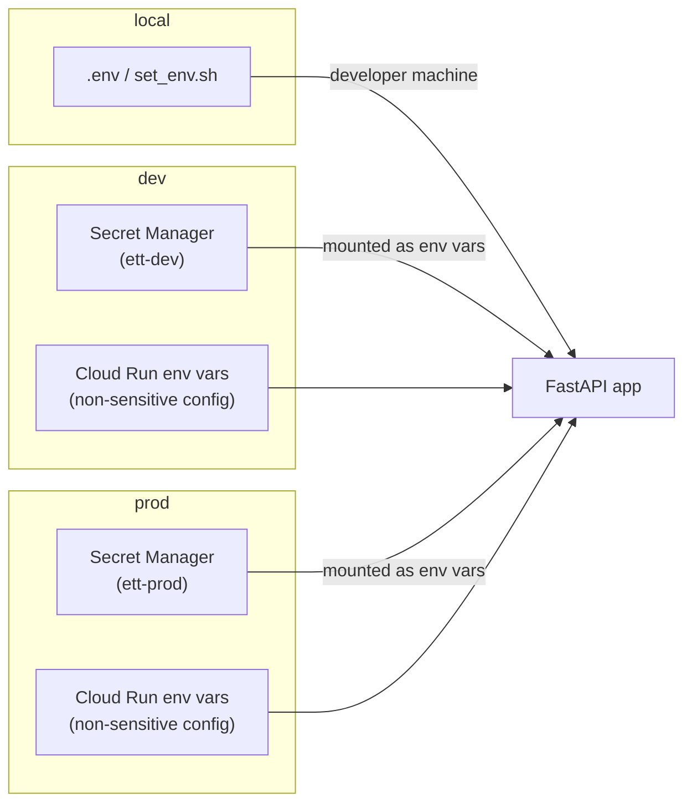
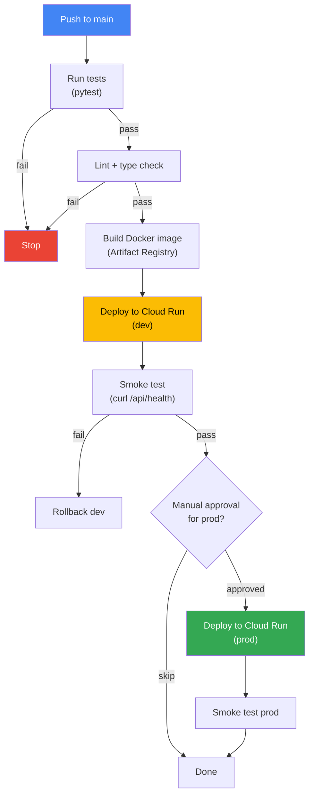

# 004 — Deployment Pipeline

*Status: Draft*
*Depends on: 003 (backend API)*
*Estimated issues: 6-8*

---

## Goal

Define the infrastructure and CI/CD pipeline to deploy the FastAPI backend to Cloud Run and (later) the React frontend to Firebase Hosting. At the end of this spec, pushing to `main` triggers an automated deploy to the dev environment, and production deploys are gated by manual approval.

---

## Why this is fourth

You need a working backend (003) before you can deploy it. And deployment infrastructure must exist before the frontend (005) can be deployed alongside it.

---

## Scope

### In scope
- Backend Dockerfile (multi-stage, production-ready)
- `firebase.json` with hosting + Cloud Run rewrite
- Cloud Run service configuration
- Cloud SQL connection from Cloud Run
- Environment variable and secret management
- GitHub Actions CI/CD (test → build → deploy)
- Dev and prod environment setup
- Local docker-compose for optional containerized dev

### Out of scope
- Frontend deployment (added in 005 when the React app exists)
- Custom domain setup (manual, post-deploy)
- Monitoring and alerting (future enhancement)
- CDN caching rules (future optimization)

---

## Deployment topology



---

## Dockerfile



### Key decisions
- **Port 8080**: Cloud Run's default expected port
- **Multi-stage build**: Keeps the runtime image small (no compilers, build tools)
- **`core/` and `backend/` only**: The image doesn't need `frontend/`, `ui/`, `cli/`, `tests/`, or `app.py`
- **No secrets in image**: All secrets come from environment variables or Secret Manager at runtime

---

## Firebase configuration

### `firebase.json`

```json
{
  "hosting": {
    "public": "frontend/dist",
    "ignore": ["firebase.json", "**/node_modules/**"],
    "rewrites": [
      {
        "source": "/api/**",
        "run": {
          "serviceId": "ett-backend",
          "region": "us-central1"
        }
      },
      {
        "source": "**",
        "destination": "/index.html"
      }
    ]
  }
}
```

### `.firebaserc`

```json
{
  "projects": {
    "dev": "ett-dev",
    "prod": "ett-prod"
  }
}
```

---

## Cloud Run configuration

| Setting | Dev | Prod | Rationale |
|---------|-----|------|-----------|
| Min instances | 0 | 1 | Dev can cold-start; prod stays warm |
| Max instances | 2 | 10 | Dev is low-traffic; prod scales |
| Memory | 512 MB | 1 GB | Ingestion pipeline needs headroom |
| CPU | 1 | 1 | Sufficient for I/O-bound workloads |
| Request timeout | 300s | 300s | Ingestion can take 30-60s |
| Concurrency | 80 | 80 | Default, appropriate for async FastAPI |
| Cloud SQL connection | Auth Proxy sidecar | Auth Proxy sidecar | Recommended by GCP |

---

## Secret management



### What goes where

| Variable | Secret Manager | Cloud Run env var | Notes |
|----------|---------------|-------------------|-------|
| `ANTHROPIC_API_KEY` | Yes | — | Sensitive |
| `VOYAGE_API_KEY` | Yes | — | Sensitive |
| `PERPLEXITY_API_KEY` | Yes | — | Sensitive |
| `API_NINJAS_KEY` | Yes | — | Sensitive |
| `DATABASE_URL` | Yes | — | Contains credentials |
| `ETT_ENV` | — | Yes | `dev` or `prod` |
| `FIREBASE_PROJECT_ID` | — | Yes | Not secret |
| `GOOGLE_CLOUD_PROJECT` | — | Automatic | Set by Cloud Run |

---

## CI/CD pipeline



### GitHub Actions workflow summary

1. **On push to `main`**: test → lint → build → deploy to dev → smoke test
2. **On manual trigger** (workflow_dispatch): deploy to prod with approval gate
3. **On pull request**: test + lint only (no deploy)

---

## Local docker-compose

Optional alternative to bare-metal local development. Useful for testing the containerized backend or for contributors who don't want to install Postgres locally.

```yaml
# Conceptual — not final implementation
services:
  db:
    image: pgvector/pgvector:pg16
    environment:
      POSTGRES_DB: earnings_teacher
      POSTGRES_HOST_AUTH_METHOD: trust
    ports:
      - "5432:5432"
    volumes:
      - pgdata:/var/lib/postgresql/data

  backend:
    build:
      context: .
      dockerfile: backend/Dockerfile
    environment:
      ETT_ENV: local
      DATABASE_URL: postgresql://postgres@db/earnings_teacher
    env_file: .env
    ports:
      - "8000:8080"
    depends_on:
      - db

volumes:
  pgdata:
```

---

## GCP project setup checklist

These are one-time manual steps before the CI/CD pipeline works:

- [ ] Create Firebase projects: `ett-dev` and `ett-prod`
- [ ] Enable Cloud Run API in both projects
- [ ] Create Cloud SQL instances in both projects
- [ ] Enable Secret Manager API in both projects
- [ ] Create secrets for API keys in both projects
- [ ] Create Artifact Registry repository for Docker images
- [ ] Set up GitHub Actions service account with deploy permissions
- [ ] Configure Firebase Auth (Google provider) in both projects
- [ ] Run initial schema migration on both Cloud SQL instances

---

## Verification criteria

- [ ] `docker compose up` starts Postgres + backend locally
- [ ] Backend container responds to `/api/health` on port 8080
- [ ] `firebase deploy --only hosting` serves static files with `/api/*` rewrite
- [ ] GitHub Actions pipeline runs tests on PR
- [ ] GitHub Actions pipeline deploys to dev on push to main
- [ ] Dev environment Cloud Run connects to Cloud SQL successfully
- [ ] Secrets are loaded from Secret Manager (not baked into image)

---

## Issue breakdown

### Epic: Deployment Pipeline [004]

**Depends on:** Epic [003] (backend API — need a working app to deploy)

| Sub-issue | Title | Description | Depends on |
|-----------|-------|-------------|------------|
| `[004.1]` | Backend Dockerfile (multi-stage) | Build + runtime stages, port 8080, health check | — |
| `[004.2]` | `docker-compose.yml` for local dev | Postgres (pgvector) + backend service | 004.1 |
| `[004.3]` | Firebase project setup + `firebase.json` | Create `ett-dev` and `ett-prod` projects, configure hosting rewrites | — |
| `[004.4]` | Cloud Run service configuration | `gcloud` scripts or Terraform for dev + prod service config | 004.3 |
| `[004.5]` | Secret Manager setup | Create secrets for API keys, configure Cloud Run to mount them | 004.3 |
| `[004.6]` | GitHub Actions: test + lint on PR | Pytest + type checking on pull requests | — |
| `[004.7]` | GitHub Actions: build + deploy to dev | Docker build, push to Artifact Registry, deploy to Cloud Run on push to main | 004.1, 004.4, 004.5, 004.6 |
| `[004.8]` | GitHub Actions: prod deploy with approval | Manual trigger, approval gate, smoke test | 004.7 |

> 004.1, 004.3, and 004.6 can all be worked in parallel (no dependencies between them). 004.4 and 004.5 can be worked in parallel after 004.3. 004.7 is the integration point that ties everything together.

See [conventions.md](../conventions.md) for epic/sub-issue naming and workflow.
