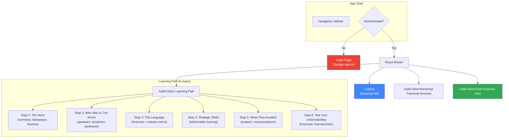
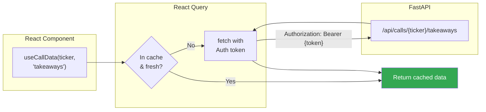
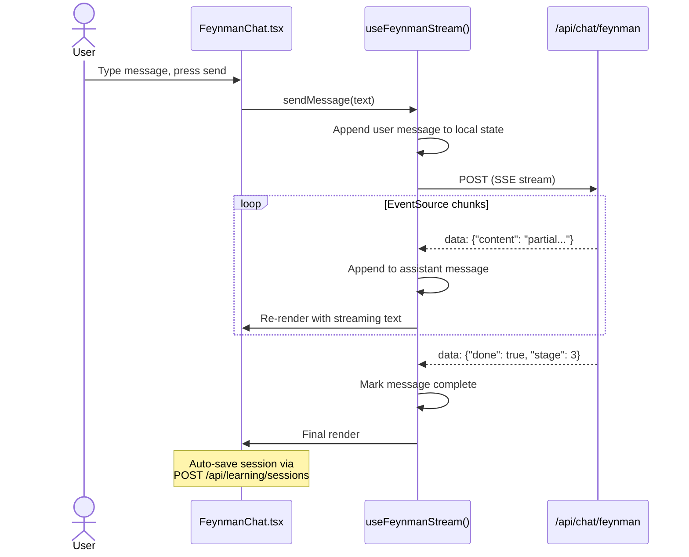

# 005 — React Frontend

*Status: Planned*
*Depends on: 003 (backend API), 004 (deployment pipeline)*
*Estimated issues: 10-15*

---

## Implementation status

**Status:** Partially implemented

**What was built:**
- Next.js application at `web/` (not Vite + React as spec'd) — see `web/AGENTS.md` for Next.js-specific conventions
- Auth via Supabase (not Firebase JS SDK)
- App Router with server and client components; no React Router
- Pages: home (`/`), call library, ticker detail (`/calls/[ticker]`), Feynman learning (`/calls/[ticker]/learn`), admin dashboard + health + ingest
- API client layer at `web/lib/api.ts` with Supabase auth token injection
- SSE streaming client at `web/lib/chat.ts`
- Supabase server/client helpers at `web/lib/supabase/`

**Remaining / diverged:**
- Build tool changed: Vite + React SPA → Next.js (App Router, server components)
- Auth provider changed: Firebase JS SDK → Supabase Auth
- Data fetching: TanStack Query was not adopted; server components fetch directly via `createSupabaseServerClient()` or the backend API
- Component library and styling choices from spec (Shadcn/ui or Headless UI, Tailwind) may differ from what was implemented — verify `web/package.json`
- Learning Path steps 3–6 (Language, Strategic Shifts, Evasion, Test Understanding): verify current implementation state
- Step progress tracking UI: verify whether `web/lib/` hooks for progress exist
- Transcript Browser page: verify current state
- E2E tests (Playwright): verify whether any exist in `web/`
- Deployment target: Firebase Hosting was replaced; verify actual hosting setup (likely Vercel given `web/vercel.json`)

---

## Goal

Build a React SPA that achieves feature parity with the current Streamlit UI. The frontend consumes the FastAPI backend (003), authenticates via Firebase Auth, and deploys to Firebase Hosting (004). At the end of this spec, the Streamlit app can be retired.

---

## Why this is last

The frontend is a consumer of everything else. It needs API endpoints to call (003), a deployed backend to talk to in dev (004), and a stable `core/` layer underneath (001, 002). Building the frontend first would mean mocking everything — wasted effort when the real APIs are within reach.

---

## Scope

### In scope
- Vite + React + TypeScript project scaffolding
- Firebase Auth integration (Google sign-in)
- Page routing (React Router)
- API client layer with auth token injection
- Feature-parity pages: Library, Learning Path (6 steps), Transcript Browser, Feynman Chat
- SSE streaming consumer for Feynman chat
- Responsive layout (mobile-aware, not mobile-first)
- Loading states via React Suspense + async data fetching

### Out of scope
- Mobile app (future)
- Offline mode (future)
- Admin panel (future)
- Payment/billing UI (future)

---

## Page structure



---

## Streamlit → React feature mapping

| Streamlit Feature | React Equivalent | Component |
|-------------------|-----------------|-----------|
| `ui/library.py` — transcript list with stats | Library page with cards | `pages/Library.tsx` |
| `ui/sidebar.py` — ticker selector, nav | Sidebar with React Router links | `components/Sidebar.tsx` |
| `ui/metadata_panel.py` — 6-step learning path | Tabbed/stepper component | `pages/LearningPath.tsx` |
| `ui/transcript_browser.py` — full transcript with search | Virtualized text list with search | `pages/TranscriptBrowser.tsx` |
| `ui/feynman.py` — 5-stage Socratic chat | Chat interface with SSE streaming | `pages/FeynmanChat.tsx` |
| `ui/term_actions.py` — inline term editing | Inline edit popover | `components/TermEditor.tsx` |
| `ui/data_loaders.py` — cached data fetching | React Query / TanStack Query hooks | `hooks/useCallData.ts` |
| `st.session_state` — chat history, stage, toggles | React state (useState/useReducer) or Zustand | `hooks/` + context |
| `st.cache_data` — memoized DB queries | React Query cache with stale-while-revalidate | Automatic via React Query |
| Step progress tracking | API calls to `/api/learning/progress/*` | `hooks/useProgress.ts` |

---

## Data fetching strategy



### Key decisions
- **TanStack Query (React Query)** for all server state — handles caching, background refetching, loading/error states
- **Auth token injected automatically** via a shared API client that calls `firebase.auth().currentUser.getIdToken()` before each request
- **Suspense boundaries** at the page level — each page shows a skeleton while data loads
- **No global state library** unless complexity warrants it — React Query + React context should suffice initially

---

## Feynman chat streaming



### Implementation notes
- Use `fetch()` with `ReadableStream` (not EventSource, since we're POSTing)
- Parse SSE format manually from the stream
- Display streaming text with a typing indicator
- Auto-save session state after each complete exchange

---

## Component hierarchy (key components)

```
App.tsx
├── AuthProvider (Firebase context)
├── QueryClientProvider (React Query)
├── Router
│   ├── LoginPage
│   └── AuthenticatedLayout
│       ├── Sidebar
│       │   ├── TickerSelector
│       │   ├── NavLinks
│       │   └── LearningStats
│       └── Outlet (page content)
│           ├── Library
│           │   └── TranscriptCard (repeated)
│           ├── LearningPath
│           │   ├── StepNav (step tabs/stepper)
│           │   ├── StoryStep
│           │   ├── SpeakersStep
│           │   ├── LanguageStep
│           │   │   └── TermEditor
│           │   ├── StrategicShiftsStep
│           │   ├── EvasionStep
│           │   └── TestUnderstandingStep
│           ├── TranscriptBrowser
│           │   ├── SearchBar
│           │   └── SpanList (virtualized)
│           └── FeynmanChat
│               ├── MessageList
│               ├── StageIndicator
│               └── ChatInput
```

---

## Tech stack

| Concern | Choice | Rationale |
|---------|--------|-----------|
| Build tool | Vite | Fast dev server, good TypeScript support |
| Language | TypeScript (strict) | Type safety across the API boundary |
| Routing | React Router v6 | Standard, mature |
| Data fetching | TanStack Query v5 | Caching, background refetch, Suspense support |
| Styling | Tailwind CSS or CSS Modules | TBD — either works; Tailwind is faster to prototype |
| Component library | Shadcn/ui or Headless UI | TBD — accessible primitives without heavy framework |
| Auth | Firebase JS SDK v9+ | Tree-shakeable, modular |
| SSE parsing | Native fetch + ReadableStream | No library needed |

> Styling and component library choices should be finalized before implementation begins. A small spike (1-2 hours) to prototype a single page with each option would inform the decision.

---

## Verification criteria

- [ ] Login page authenticates via Google and redirects to Library
- [ ] Library page lists all ingested transcripts with metadata
- [ ] Learning Path renders all 6 steps with correct data for a ticker
- [ ] Step progress persists across sessions (saved to API)
- [ ] Transcript Browser displays full transcript with working search
- [ ] Feynman Chat streams responses in real-time
- [ ] Feynman session is auto-saved and appears in session history
- [ ] Unauthenticated users are redirected to login
- [ ] `npm run build` produces a deployable `dist/` folder
- [ ] Deployed to Firebase Hosting with `/api/*` rewrite working

---

## Issue breakdown

### Epic: React Frontend [005]

**Depends on:** Epic [003] (backend API), Epic [004] (deployment pipeline)

#### Foundation

| Sub-issue | Title | Description | Depends on |
|-----------|-------|-------------|------------|
| `[005.1]` | Scaffold Vite + React + TypeScript project | `frontend/` directory, config, base dependencies | — |
| `[005.2]` | Firebase Auth integration | Auth provider, login page, token injection | 005.1 |
| `[005.3]` | API client layer | Shared fetch client with auth headers, error handling | 005.2 |
| `[005.4]` | React Query setup + data hooks | Query client, hooks for each API endpoint | 005.3 |
| `[005.5]` | App shell: routing + sidebar + layout | React Router, authenticated layout, navigation | 005.2 |

#### Pages

| Sub-issue | Title | Description | Depends on |
|-----------|-------|-------------|------------|
| `[005.6]` | Library page | Transcript cards, learning stats, ticker selection | 005.4, 005.5 |
| `[005.7]` | Learning Path: Steps 1-2 (Story, Speakers) | Summary, takeaways, themes, speaker dynamics | 005.4, 005.5 |
| `[005.8]` | Learning Path: Steps 3-4 (Language, Strategic Shifts) | Term display with inline editing, shift cards | 005.4, 005.5 |
| `[005.9]` | Learning Path: Steps 5-6 (Evasion, Test Understanding) | Evasion cards, misconceptions, Feynman launcher | 005.4, 005.5 |
| `[005.10]` | Step progress tracking | Mark steps viewed, progress indicators | 005.7 |
| `[005.11]` | Transcript Browser | Full transcript with search, speaker highlighting | 005.4, 005.5 |
| `[005.12]` | Feynman Chat with SSE streaming | Chat UI, streaming text display, session save | 005.3, 005.5 |

#### Polish & Deploy

| Sub-issue | Title | Description | Depends on |
|-----------|-------|-------------|------------|
| `[005.13]` | Styling pass + responsive layout | Consistent design, mobile-aware breakpoints | 005.6–005.12 |
| `[005.14]` | Frontend E2E tests | Playwright or similar for critical user flows | 005.6–005.12 |
| `[005.15]` | Firebase Hosting deployment | Build + deploy to `frontend/dist`, verify rewrites | 005.13 |

> Foundation issues (005.1–005.5) are sequential. Page issues (005.6–005.12) can be worked in parallel once the foundation is in place. Polish and deploy are final.

See [conventions.md](../conventions.md) for epic/sub-issue naming and workflow.
